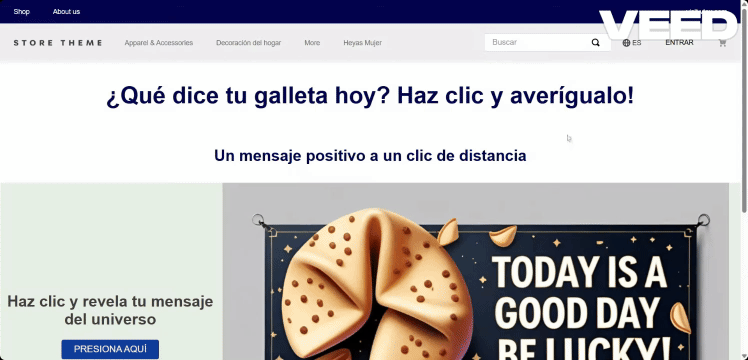

# Store theme

<!-- ALL-CONTRIBUTORS-BADGE:START - Do not remove or modify this section -->

[](#contributors-)

<!-- ALL-CONTRIBUTORS-BADGE:END -->

Our boilerplate theme to create stores in the VTEX IO platform.

## Preview


## Tutorial

To understand how things work check our tutorial [Build a store using VTEX IO](https://vtex.io/docs/getting-started/build-stores-with-store-framework/1/)

## Dependencies

All store components that you see on this document are open source too. Production ready, you can found those apps in this GitHub organization.

Store framework is the baseline to create any store using _VTEX IO Web Framework_.

- [Store](https://github.com/vtex-apps/store/blob/master/README.md)

Store GraphQL is a middleware to access all VTEX APIs.

- [Store GraphQL](https://github.com/vtex-apps/store-graphql/blob/master/docs/README.md)

### Store Component Apps

- [Header](https://github.com/vtex-apps/store-header/blob/master/docs/README.md)
- [Footer](https://github.com/vtex-apps/store-footer/blob/master/docs/README.md)
- [Slider Layout](https://github.com/vtex-apps/slider-layout/blob/master/docs/README.md)
- [Shelf](https://github.com/vtex-apps/shelf/blob/master/docs/README.md)
- [Telemarketing](https://github.com/vtex-apps/telemarketing/blob/master/docs/README.md)
- [Menu](https://github.com/vtex-apps/menu/blob/master/docs/README.md)
- [Login](https://github.com/vtex-apps/login/blob/master/docs/README.md)
- [Minicart](https://github.com/vtex-apps/minicart/blob/master/docs/README.md)
- [Category Menu](https://github.com/vtex-apps/category-menu/blob/master/docs/README.md)
- [Product Summary](https://github.com/vtex-apps/product-summary/blob/master/docs/README.md)
- [Breadcrumb](https://github.com/vtex-apps/breadcrumb/blob/master/docs/README.md)
- [Search Result](https://github.com/vtex-apps/search-result/blob/master/docs/README.md)
- [Product Details](https://github.com/vtex-apps/product-details/blob/master/docs/README.md)
- [Store Components](https://github.com/vtex-apps/store-components/blob/master/docs/README.md)
- [Order Placed](https://github.com/vtex-apps/order-placed/blob/master/docs/README.md)

### Store Pixel Apps

- [Facebook Pixel](https://github.com/vtex-apps/facebook-pixel/blob/master/docs/README.md)
- [Google Tag Manager](https://github.com/vtex-apps/google-tag-manager/blob/master/docs/README.md)

## Componente Custom: `store.custom#fortune-cookies`

Este componente custom permite mostrar una página de "Fortune Cookies" en tu tienda VTEX IO, integrando un layout flexible y un mensaje motivacional.

## 

### ¿Cómo usarlo?

1. **Declaración de la ruta**

Asegúrate de tener la ruta configurada en [`store/routes.json`](store/routes.json):

```json
"store.custom#fortune-cookies": {
  "path": "/fortune-cookies"
}
```

2. **Declaración del bloque**

El bloque ya está declarado en [`store/blocks/fortune-cookies.jsonc`](store/blocks/fortune-cookies.jsonc):

```jsonc
"store.custom#fortune-cookies": {
  "children": ["flex-layout.row#container-fortune-cookies"]
}
```

3. **Estructura del layout**

El bloque utiliza `flex-layout` para estructurar la página y contiene:

- Un título usando `rich-text#fortune-cookies`
- El componente custom `fortune-cookies` (debes tener instalado el app `valtech.fortune-cookies`)

4. **Agregar el bloque a tu tienda**

Para que la página sea accesible, asegúrate de que la ruta `/fortune-cookies` esté activa y publicada.

5. **Personalización**

Puedes personalizar los textos y estilos modificando los props en [`fortune-cookies.jsonc`](store/blocks/fortune-cookies.jsonc) y los estilos CSS en la carpeta [`styles/css/fortune-cookies/`](styles/css/fortune-cookies/).

## Requisitos

- Tener como dependencia el app `valtech.fortune-cookies` en tu [`manifest.json`](manifest.json):

```json
"valtech.fortune-cookies": "0.x"
```

## Ejemplo de acceso

Visita `/fortune-cookies` en tu tienda para ver el componente en acción.

---

Para más información sobre cómo crear y usar bloques custom en VTEX IO, consulta la [documentación oficial](https://vtex.io/docs/).

## Contributing

Check it out [how to contribute](https://github.com/vtex-apps/awesome-io#contributing) with this project.

## Contributors ✨

Thanks goes to these wonderful people ([emoji key](https://allcontributors.org/docs/en/emoji-key)):

<!-- ALL-CONTRIBUTORS-LIST:START - Do not remove or modify this section -->
<!-- prettier-ignore-start -->
<!-- markdownlint-disable -->
<table>
  <tr>
    <td align="center"><a href="http://www.hugoccosta.com"><br /><sub><b>Hugo Costa</b></sub></a><br /><a href="https://github.com/vtex-apps/store-theme/commits?author=hugocostadev" title="Documentation">📖</a></td>
  </tr>
  <tr>
    <td align="center"><a href="https://github.com/lenninIbarrraGonzalez"><br /><sub><b>Lennin Ibarra</b></sub></a><br /><a href="https://github.com/lenninIbarrraGonzalez" title="Documentation">📖</a></td>
  </tr>
</table>

<!-- markdownlint-enable -->
<!-- prettier-ignore-end -->

<!-- ALL-CONTRIBUTORS-LIST:END -->

This project follows the [all-contributors](https://github.com/all-contributors/all-contributors) specification. Contributions of any kind welcome!
